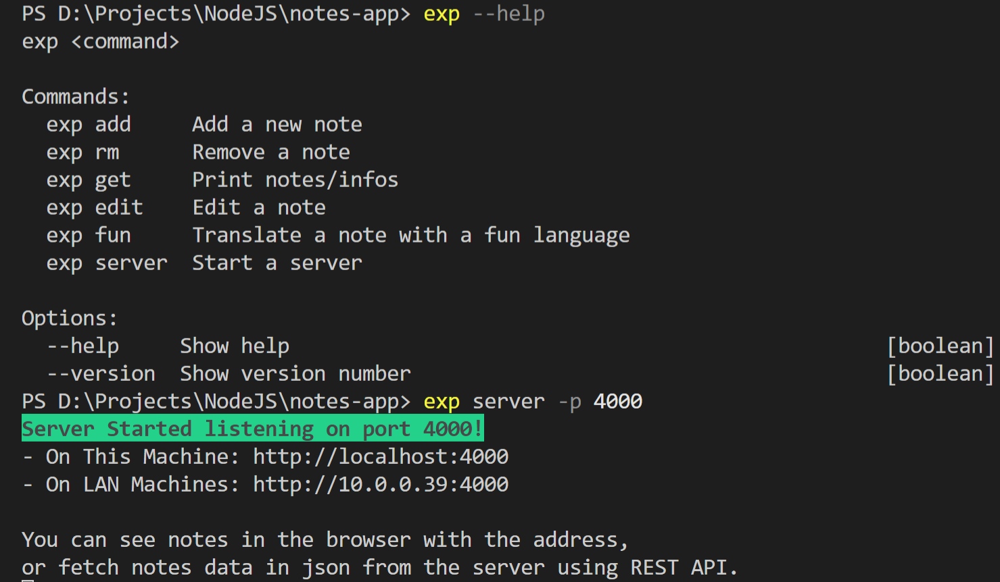

# Project Exp

## Description
Exp project starts from a very simple Node.js CLI app that has a single feature: note down what just flew into my mind.

Well, there are dozens of ready-to-use apps that do exactly this, why did I make this one?

This is proabably just my paranoid but I want an exlusive place to store my thoughts/experiences gained on life, people and the world. All the apps available on the web are just too complicated. There are numerous feature I won't use and I don't want to mix up my technical notes with these. Hence this app.

In Auguest 2022, I integrated Express.JS so that this app is able to fire up on my localhost. I also made a simple front-end with Express.JS. There are more work to come...

## Build

Clone this repo and run `npm install & npm link`.

Start your first exp with `exp add`!

## REST API

After server start, navigate to API tab to see a list of APIs.
